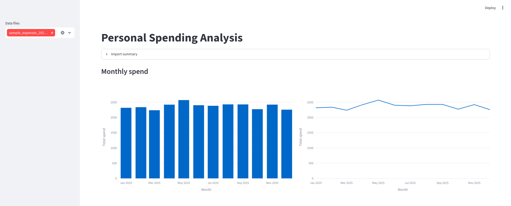
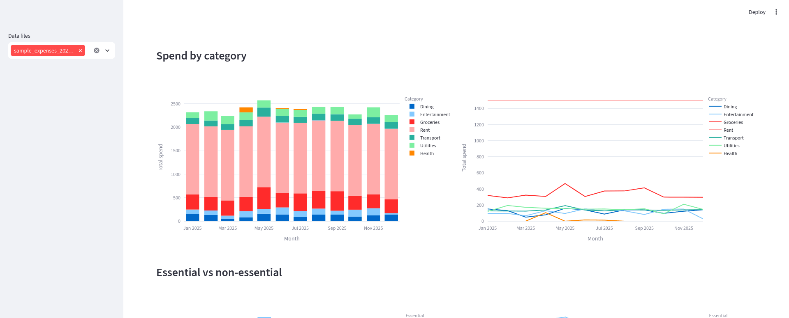
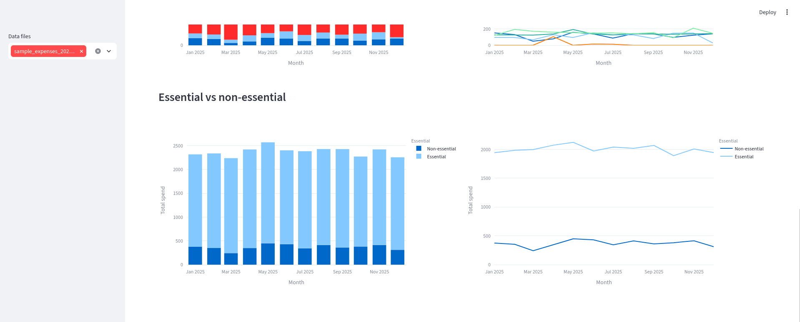

# Personal Spending Analysis

A local, single-user tool that reads personal spending data from spreadsheets, analyzes it, and presents the results as an interactive dashboard. It is a prototype focused on a clean, layered analysis core (ingest -> analysis -> viz -> ui) that can grow without a rewrite.

Point it at a folder of your own spreadsheets and it charts where your money goes, month by month.



## Features

- **Total spend per month** - your overall monthly outgoings, as a bar chart and a line chart.
- **Spend by category per month** - a stacked breakdown across categories (groceries, rent, dining, ...), so you can see what each month was made of.
- **Essential vs non-essential per month** - essential and discretionary spend side by side. Shown only when the `essential` column is present and complete across every imported sheet, so the split is never partial or misleading.
- **Refund-aware** - negative amounts (refunds) net naturally within each month's totals.
- **Combines multiple files** - drop in one spreadsheet per year (or per account) and they are analyzed together.
- **Visible import diagnostics** - an import summary reports which sheets were skipped and why, and how many rows were dropped for bad dates or non-numeric prices, so import problems are never silent.





## Prerequisites

- [uv](https://docs.astral.sh/uv/) for dependency and project management.
- Python 3.13 (uv will provision it automatically if it is not already installed).

Optional (not installed by `uv sync`):

- [prek](https://github.com/j178/prek) - runs the git hooks and `make format`. Install it with `uv tool install prek`, or run it ad-hoc with `uvx prek`. Not needed to run the app or the quality gate. Alternate install instructions can also be found on their repo.
- Docker - see [Running in Docker](#running-in-docker).

## Setup

```bash
uv sync
```

This creates the virtual environment and installs the project (the `spending` package) plus its dependencies from the committed `uv.lock`.

## Data

Spending data lives in a `data/` directory at the repository root. That directory is git-ignored: spreadsheets are authored and maintained elsewhere and are never committed. A fresh clone starts empty - add your own files, or use the bundled sample below.

**Supported formats:** `.csv`, `.xlsx`, `.xlsm`. Excel files may contain multiple sheets; each sheet is examined independently, and any sheet that looks like data is imported (so a `Summary` or `Categories` tab is simply skipped and reported).

**Columns** are matched case-insensitively by name (not by position or sheet name):

| Column      | Required | Notes                                                         |
|-------------|----------|---------------------------------------------------------------|
| `date`      | yes      | Use ISO dates (`2026-08-01`) for unambiguous parsing.         |
| `price`     | yes      | Also matches `amount` or `cost`. May be negative (refunds).   |
| `category`  | yes      | Free text; lightly normalized (whitespace trimmed).           |
| `item`      | no       | Imported if present, otherwise ignored.                       |
| `essential` | no       | Accepts `TRUE`/`FALSE`, `yes`/`no`, `T`/`F`, `1`/`0`.         |

A sheet needs all three required columns to be imported; a `notes` column, if present, is dropped.

### Try it with the bundled sample

A small synthetic dataset (fake data, one year of 2025 spending) is included so you can see the dashboard immediately:

```bash
cp examples/sample_expenses_2025.csv data/
```

## Running

### Locally

```bash
make run-app
```

Then open the URL Streamlit prints (http://localhost:8501 by default). Use the sidebar to choose which files in `data/` to analyze.

### Running in Docker

The app is packaged as a container that serves the dashboard on port 8501. Your data is mounted in at runtime (read-only) and is never baked into the image.

```bash
make docker-build   # docker compose build
make docker-run     # docker compose up
```

`docker-compose.yml` mounts `./data` into the container, so place your spreadsheets there first (or copy in the sample above). Open http://localhost:8501.

## Quality gates

The full gate mirrors what CI runs on every pull request:

```bash
make check          # ruff lint + format check, mypy, pytest
```

Or run the pieces individually:

```bash
make test                       # uv run pytest
uv run mypy                     # strict type checking
uv run ruff check .             # linting
uv run ruff format --check .    # formatting
```

`make format` auto-fixes formatting and lint via [prek](https://github.com/j178/prek). Pre-commit hooks run format + lint on commit and the test suite on push. Run `make help` to list all targets.

## Architecture

The tool is split into four layers, each depending only on the one before it:

```
ingest  ->  analysis  ->  viz  ->  ui
```

- **ingest** reads the files, matches and validates columns, cleans rows, and produces one canonical `SpendingData` structure plus an import report.
- **analysis** takes that structure and returns aggregated data (tidy DataFrames). Pure data-in / data-out, with no charting or framework dependency.
- **viz** turns aggregated data into Plotly figures, framework-agnostic.
- **ui** is a thin Streamlit shell that wires the layers together, caches the import, and lays out the page.

Dependencies point one way only, which keeps the analysis core reusable and the UI cheap to swap. The full rationale, data model, and package layout are in [`design_docs/design_spec.md`](design_docs/design_spec.md); the stack choices are in [`design_docs/framework_selection.md`](design_docs/framework_selection.md).

## Roadmap

The core idea is to push the prototype as far as possible with regards to analysis, and only adjust the framework as limitations arise. Specifically, once we outgrow Streamlit we can pivot to NiceGUI/Dash (and if we need a persistence layer, a local DB). Should the project ever need to be hosted (and need per-user authentication), we can shift to separate frontend/backend separation as needed.

Directions the prototype is built toward but does not yet implement (see [Section 10 of the design spec](design_docs/design_spec.md#10-deferred-and-future-work)):

- **Persistence** - a local database (DuckDB is the likely target) so data is not re-read from files on every refresh.
- **Framework growth path** - Streamlit now; NiceGUI / Dash, then a separate frontend, only when a concrete need forces it. Backend file import and analysis was designed to be framework agnostic (written as a package), so shifting to a proper backend framework should not be an issue either.
- **More analyses** - added as new pure functions in `analysis` with matching builders in `viz` (for example, income analysis, projections, and so on).
- **Richer normalization** - heavier handling of free-text fields, deferred until a feature needs it.

## Built with AI

This prototype was planned and generated with the assistance of Claude (Anthropic). Claude was used to pressure-test design decisions, draft code and documentation, and review changes.

I still made the architectural decisions and reviewed all output and code generated; AI tooling just sped up the prototype loop and acted as a good rubber duck + reviewing tool (useful as a solo developer).

## License

Released under the [MIT License](LICENSE).
